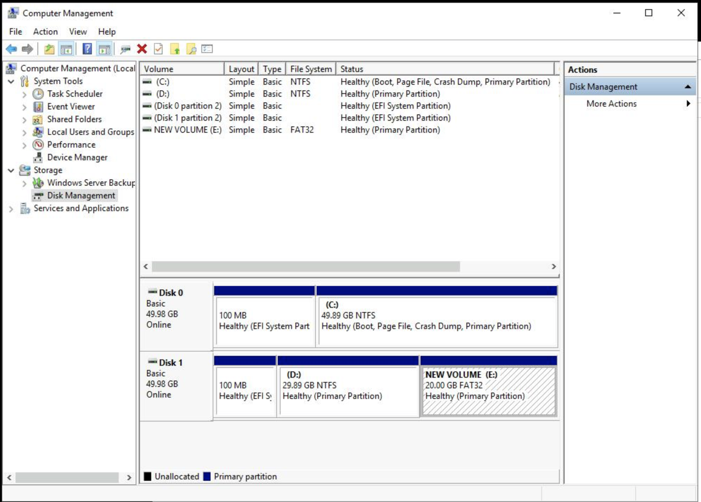

# Partitioning and Formatting a Disk Drive in Windows

On Windows systems, a common practice is to use one primary partition that contains the operating system, applications, and user data. The drive letter C: is mostly used to identify this partition. Other partitions are created on the hard disk for specialized functions, like storing data of a specific type. It's also common practice to assign partition letter names in order, creating disk partition D:, E:, F:, and so on.

In this lab, you'll see how this is done by partitioning an extra disk attached to the system into two partitions of 1GB and 9GB each.

# Partitioning a disk using control panel

Windows provides tools for disk management through the GUI. Among many other administrative tasks, the Control Panel in Windows also enables users to manage storage devices attached to the system.

Go ahead and open Control Panel by clicking on the Start button and selecting Control Panel.

While in Control Panel, navigate to System and Security, then Administrative Tools.

In the Administrative Tools window, double click on Computer Management.

From here, you can manage different services in your Windows system, including storage, task manager, etc. Since we're interested in managing disks, on the left panel, under Storage, select Disk Management.

You'll notice that your system has access to two disks, one of which contains unallocated space, and is labeled "Offline". You'll create partitions on this disk.

Note: Throughout this lab, please ignore the 100 MB partitions named EFI System Partition. Those are used to load the operating system during system boot up.

To enable partitioning, the disk will first need to be mounted on the system. Right click on the left part of the disk and select Online.

The disk will be mounted and automatically assigned the letter D:. You'll further divide this disk into two partitions.

Since the space is already allocated to the disk D:, you'll need to first shrink it before a new partition can be created. Right click on the disk and select Shrink Volume.

Control Panel will present you with a dialogue where you'll enter the size to shrink the disk. Enter 20,480MB to partition the disk into two partitions of 30GB and 20GB each. Click Shrink.

The disk will be shrunk, and the additional 20GB space will be shown as unallocated.

On this unallocated space, you'll create a new partition of 20GB in size. Right click on it and select New Simple Volume.

Control Panel will present you with a partition creation dialogue. Click Next.

A size specification dialogue will be presented, where you'll enter the size of the partition you want to create. Create a partition that takes up all the remaining space by accepting the default value in this dialogue. Then, click Next.

In the next section of the wizard, ensure the drive letter is set to E. Click Next.

In the next section of the wizard, you'll select the file format that the partition should be made up of. You'll also need to provide the label of the partition. You can provide any name you'd like, or use the default name. Leave the default partition selected, and click Next.

The last section of the wizard will be presented. Ensure the Drive letter or path is set to "E:", then click Finish.

The disk partitioning will be carried out, and the resulting disk configuration will be updated. The second disk now consists of two partitions: D: and E: of 30GB and 20GB, respectively.

# Formatting a partition

Next, you'll format a partition to a different file format.

Caution!
Formatting a partition is destructive, and will erase all data on the partition. Not good! Remember to always backup your data before modifying partitions on a live system.

To format the partition E: to a different file format, right click on it, and select Format.

Control Panel will present you with a file system formatting dialogue. In the file format drop down list, select FAT32, then click OK.

A confirmation alert with a warning will be presented. To proceed with the formatting, click OK.

The partition will be formatted to the selected file system type, and the final disk configuration will be shown.

That's it! You've successfully partitioned and formatted a disk in a Windows system.

# Conclusion
In this lab, you've gone through the process of creating partitions and formatting them to specific file systems on a Windows system. Great work! The skills you've gained here are a crucial part of your IT Support Specialist toolbox.